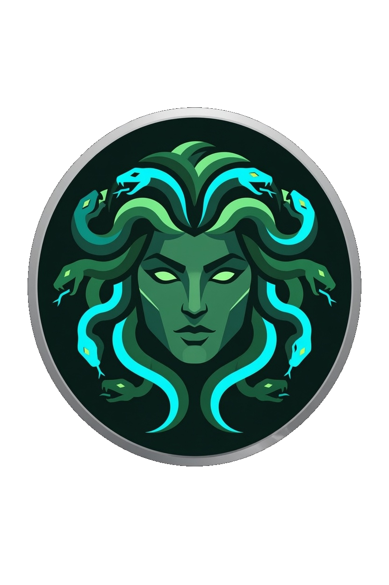
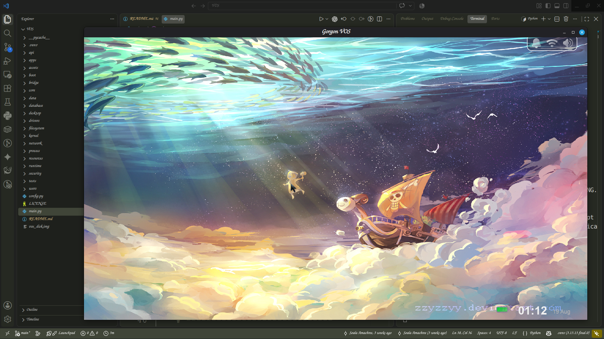
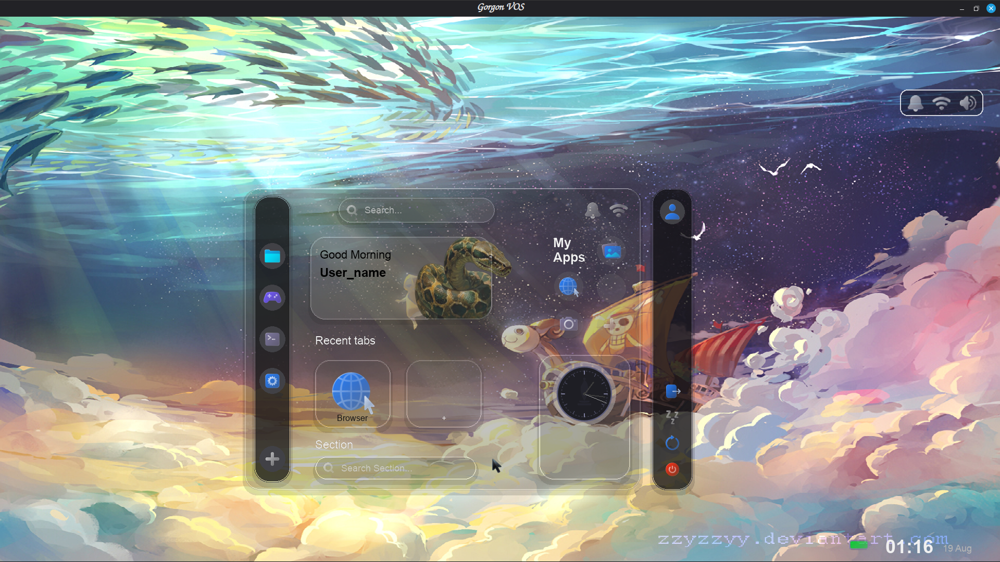
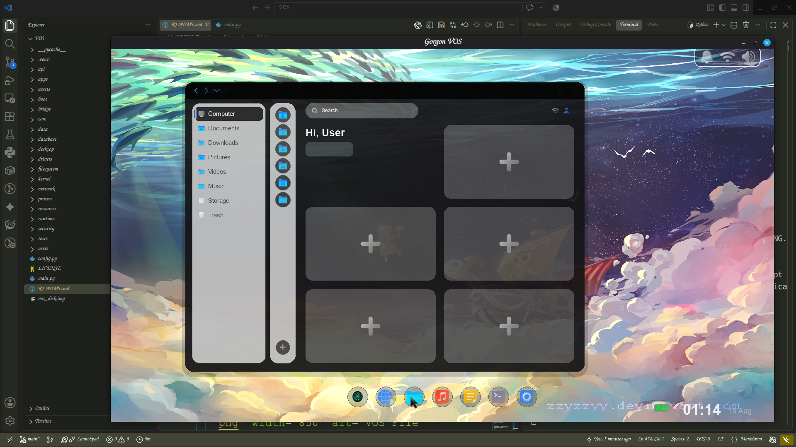
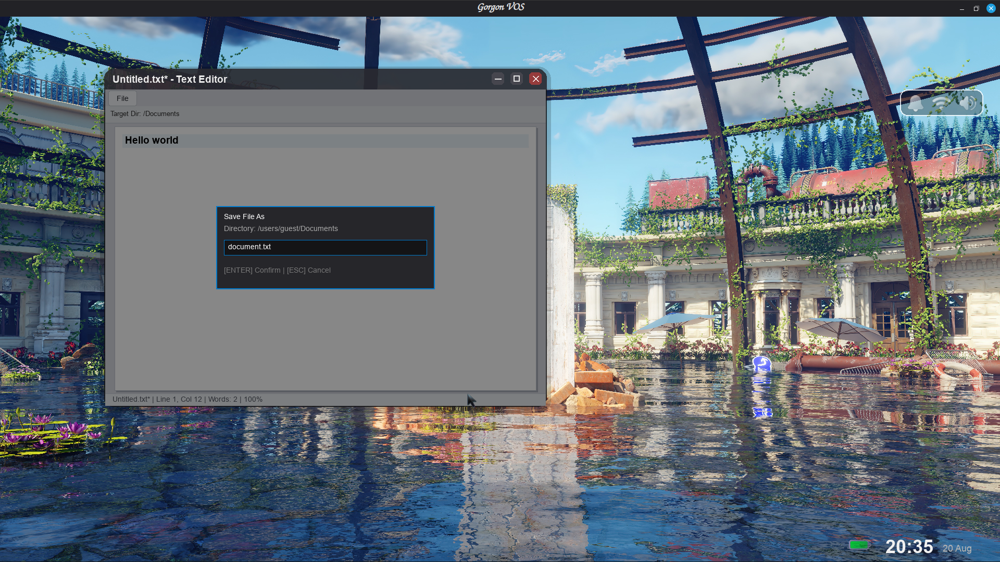
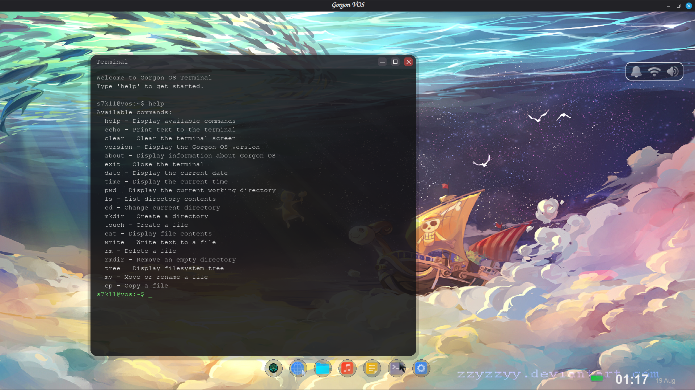

<p align="center">
  
</p>

<h1 align="center">Virtual Operating System (VOS)</h1>

<p align="center">
  A virtual operating system simulator built from scratch.
</p>

<p align="center">
  
  
  
</p>

---

## About VOS

**VOS (Virtual Operating System)** is a project where I am building an operating system from the ground up while learning how operating systems, filesystems, applications, system architecture, and lower-level programming work.

Rather than trying to jump directly into building a real operating system, I divided the project into three stages:

```text
Phase 1 — Simulator
        ↓
Phase 2 — Semi-real
        ↓
Phase 3 — Real OS
```

The current implementation is **Phase 1 — the Simulator**.

The goal of Phase 1 is to create the structure and behavior of an operating system in a controlled environment before moving closer to real hardware and lower-level system development.

---

# Current Stage

## Phase 1 — Simulator

Phase 1 focuses on simulating the major components users would interact with in an operating system.

### Current Features

* Virtual desktop environment
* Window management
* Virtual filesystem
* Persistent virtual storage
* File Explorer
* Text Editor
* Terminal / shell
* Application architecture
* File creation and saving
* Opening and editing virtual files
* Communication between applications and the virtual filesystem

The simulator is designed so that applications interact with the **VOS filesystem** rather than directly treating the host computer's filesystem as the operating system's storage.

---

# Architecture

The current architecture is being built around separating the simulated operating system from the host environment.

```text
                         VOS
                          │
                    ┌─────┴─────┐
                    │   Desktop │
                    └─────┬─────┘
                          │
              ┌───────────┼───────────┐
              │           │           │
          Explorer     Editor      Terminal
              │           │           │
              └───────────┼───────────┘
                          │
                   Application Layer
                          │
                    System Layer
                          │
                  Virtual Filesystem
                          │
                  Virtual Storage
                          │
                    Host Computer
```

The important idea is that the applications are built around VOS's own system components.

For example:

```text
Text Editor
     │
     ↓
VOS Filesystem
     │
     ↓
Virtual Storage
     │
     ↓
Host Storage
```

This allows the simulator to behave more like an operating system instead of simply being a collection of independent applications.

---

# Screenshots

## VOS Desktop

<p align="center">
  
</p>

The virtual desktop provides the main environment from which VOS applications can be launched and managed.

---

## VOS Launcher

<p align="center">  </p>

The Launcher provides a central way to discover and open applications available within VOS.

---

## VOS File Explorer

<p align="center">
  
</p>

The File Explorer interacts with the VOS virtual filesystem and allows files and directories to be created, opened, and managed.

---

## VOS Text Editor

<p align="center">
  
</p>

The Text Editor is connected to the virtual filesystem, allowing files stored inside VOS to be opened, edited, created, and saved.

---

## VOS Terminal

<p align="center">  </p>

The Terminal provides a command-line interface for interacting with VOS and its simulated.

---
# How It Works

VOS uses the host operating system as the environment in which the simulator runs, while creating its own simulated operating-system layer above it.

The host filesystem acts as the underlying storage mechanism, while VOS maintains its own representation of files and directories.

Conceptually:

```text
┌───────────────────────────────────┐
│              VOS                  │
│                                   │
│  Desktop                          │
│  Applications                     │
│  Window Manager                   │
│  Virtual Filesystem               │
│  Virtual Storage                  │
│                                   │
└────────────────┬──────────────────┘
                 │
                 ↓
┌───────────────────────────────────┐
│         Host Operating System     │
│                                   │
│       Linux / Windows / etc.      │
│                                   │
└───────────────────────────────────┘
```

This gives me a controlled environment where I can experiment with operating-system concepts without immediately dealing with hardware, bootloaders, kernels, drivers, and other problems involved in a real OS.

---

# Virtual Filesystem

One of the main components of Phase 1 is the **VOS virtual filesystem**.

Instead of allowing applications to freely manage the host filesystem, VOS provides its own filesystem interface.

This gives applications a common way to perform operations such as:

```text
Create
Read
Write
Save
Open
Delete
Rename
Create Directory
```

The goal is to make applications depend on the VOS system rather than depending directly on the host environment.

This also creates a foundation that can eventually be replaced or heavily modified when moving toward Phase 2 and Phase 3.

---

# Applications

VOS is designed around individual applications communicating with shared system components.

Current applications include:

### File Explorer

Used to navigate and manage the VOS filesystem.

### Text Editor

Used to create and edit files stored inside VOS.

### Terminal

Provides a command-line interface for interacting with the simulated system.

More applications will be added as the system develops.

---

# Project Structure

The project is organized around separating applications, system components, assets, and other parts of the simulator.

```text
VOS/
│
├── apps/
│   ├── explorer/
│   ├── editor/
│   └── ...
│
├── filesystem/
│   └── ...
│
├── system/
│   └── ...
│
├── assets/
│   ├── logo.svg
│   └── screenshots/
│
├── drivers/
│   └── ...
│
├── main.py
│
└── README.md
```

The structure will continue to change as VOS moves through the different development phases.

---

# Project Roadmap

VOS is planned as a three-stage project.

| Phase                   | Description                                                                             | Status        |
| ----------------------- | --------------------------------------------------------------------------------------- | ------------- |
| **Phase 1 — Simulator** | Simulate an operating system in a controlled environment                                | ✅ In Progress |
| **Phase 2 — Semi-real** | Move more system functionality toward lower-level and hardware-oriented implementations | ⬜ Planned     |
| **Phase 3 — Real OS**   | Build toward an actual bootable operating system                                        | ⬜ Future      |

### Phase 1

```text
Desktop
Filesystem
Storage
Applications
Window Management
Terminal
Editor
Explorer
```

### Phase 2

The goal is to gradually replace simulated components with more realistic system-level implementations.

This phase will involve significantly more work with:

* C
* C++
* Assembly
* Computer architecture
* Memory management
* Hardware interaction
* Drivers
* System interfaces

### Phase 3

The long-term goal is to move beyond simulation and begin building an actual operating system capable of interacting directly with hardware.

This will involve areas such as:

* Boot process
* Kernel development
* Memory management
* CPU interaction
* Drivers
* Filesystems
* Hardware interrupts
* Processes
* Scheduling
* System calls

---

# Installation

Clone the repository:

```bash
git clone https://github.com/Soala7/VOS.git
cd VOS
```

Create a virtual environment:

```bash
python3 -m venv .venv
```

Activate it:

### Linux / macOS

```bash
source .venv/bin/activate
```

### Windows

```powershell
.venv\Scripts\activate
```

Install the required dependencies:

```bash
pip install -r requirements.txt
```

---

# Running VOS

After installing the dependencies:

```bash
python main.py
```

VOS should launch into the virtual desktop environment.

> The exact startup command may change as the architecture develops.

---

# Development Philosophy

VOS is not being built by immediately trying to reproduce an entire operating system.

Instead, I am building it in layers.

```text
Understand
    ↓
Simulate
    ↓
Connect
    ↓
Replace
    ↓
Build for real hardware
```

The simulator allows me to understand what the individual components of an operating system actually do before attempting to implement those components at a lower level.

This also makes it easier to experiment, break things, debug them, and understand why they broke.

---

# Why I Built VOS

I've always been interested in understanding how computers work beyond the applications we normally use.

At first, the idea was simply:

> "What if I tried to make my own operating system?"

But I quickly realized that jumping straight into kernel development without understanding the underlying concepts would make the project much harder to learn from.

So I decided to build a simulator first.

VOS is therefore both a software project and a long-term learning project.

Every phase is intended to get closer to understanding how a real operating system works.

---

# Future Plans

The project is still actively being developed.

Some of the long-term goals include:

* Improve the virtual filesystem
* Expand the terminal
* Add more system applications
* Improve process and application management
* Build stronger separation between system components
* Improve VOS architecture
* Begin Phase 2
* Learn and implement lower-level system components
* Eventually move toward a real bootable operating system

The architecture will likely change considerably as my understanding of operating systems improves.

---

# Current Goal

The immediate goal is to finish polishing **Phase 1 — Simulator**, document the architecture properly, and establish a strong foundation before beginning Phase 2.

```text
Phase 1
   │
   ├── Build
   ├── Test
   ├── Document
   └── Understand
          │
          ↓
       Phase 2
          │
          ↓
       Phase 3
```

---

# Status

**VOS is currently in Phase 1 — Simulator.**

The simulator is functional and its core applications are being connected to the virtual filesystem and system architecture.

This project is still under active development, so the architecture and features are expected to change.

---

## Author

Built by **Soala Amachree**.

Learning by building.

---

## License

This project is currently under development. See the repository for licensing information.

---

