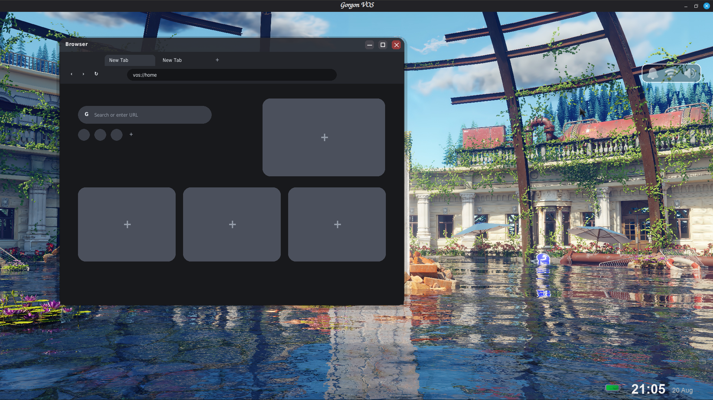
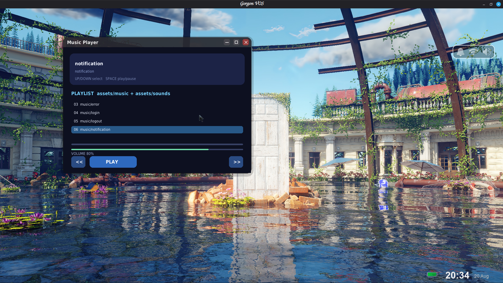
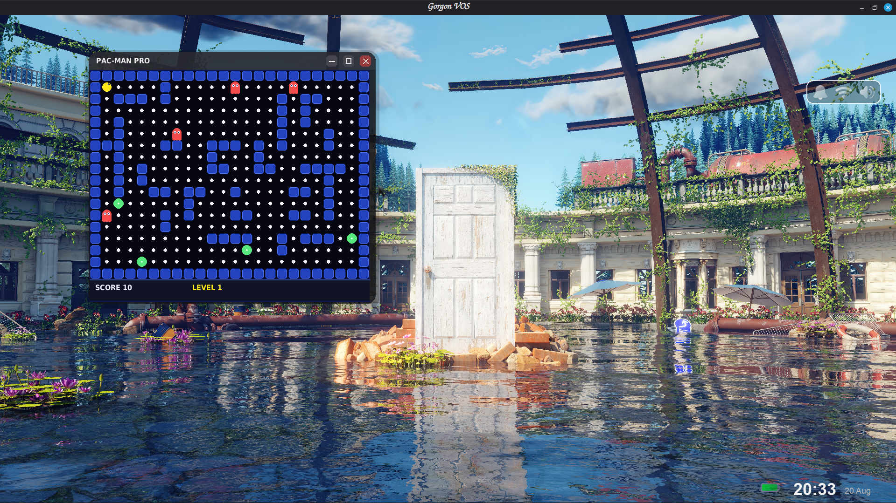
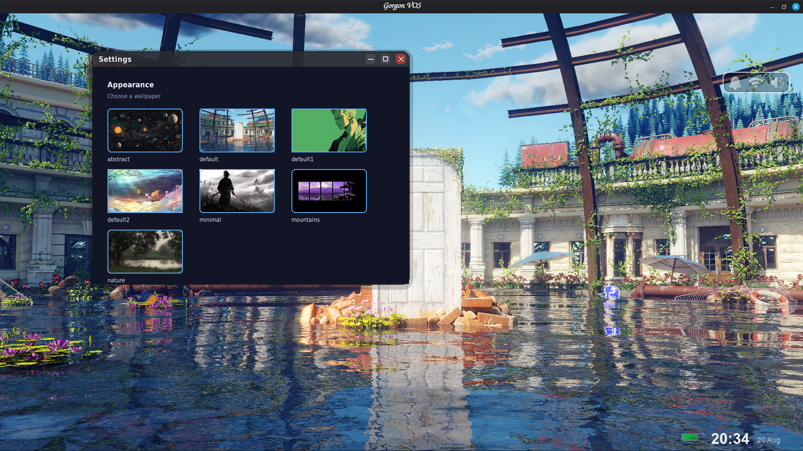

<p align="center">
  
</p>

<h1 align="center">Virtual Operating System (VOS)</h1>

<p align="center">
  A virtual operating system simulator built from scratch.
</p>

<p align="center">
  
  
  
  
</p>

---

# About VOS

**VOS (Virtual Operating System)** is a project where I am building an operating system from the ground up while learning how operating systems, filesystems, applications, system architecture, and lower-level programming work.

Rather than trying to jump directly into building a real operating system, I divided the project into three stages:

Phase 1 — Simulator
        ↓
Phase 2 — Semi-real
        ↓
Phase 3 — Real OS


**Phase 1 — Simulator is now complete.**

The purpose of Phase 1 was to create a functional simulated operating-system environment where applications, filesystems, storage, windows, and system components could communicate with each other.

This phase gave me a foundation for understanding how the different parts of an operating system fit together before moving toward lower-level development.

---

# Phase 1 — Simulator

Phase 1 focused on simulating the major components users would interact with in an operating system.

### Completed Features

* Virtual desktop environment
* Window management
* Virtual filesystem
* Persistent virtual storage
* File Explorer
* Text Editor
* Terminal / shell
* Application architecture
* Application launcher
* File creation and saving
* Opening and editing virtual files
* Virtual directories
* File operations
* Communication between applications and the virtual filesystem
* Basic system applications
* Basic browser
* Music player
* Game application
* Wallpaper settings

The simulator is designed so that applications interact with the **VOS filesystem** rather than directly treating the host computer's filesystem as the operating system's storage.

---

# Applications

VOS contains several applications that demonstrate how applications can interact with the simulated operating system.

## File Explorer

<p align="center">
  
</p>

The File Explorer interacts with the VOS virtual filesystem and allows files and directories to be created, opened, and managed.

It provides the graphical interface for navigating the simulated filesystem.

---

## Text Editor

<p align="center">
  
</p>

The Text Editor is connected to the virtual filesystem.

It allows users to:

* Create text files
* Open files
* Edit files
* Save files
* Work with files stored inside VOS

This was one of the main applications used to demonstrate communication between an application and the VOS filesystem.

---

## Terminal

<p align="center">
  
</p>

The Terminal provides a command-line interface for interacting with VOS.

The terminal contains a shell implemented with C while the graphical terminal application communicates with it through the VOS architecture.

Current commands include filesystem and system operations such as:

```text
about
cat
cd
clear
cp
date
echo
exit
help
ls
mkdir
mv
pwd
rm
rmdir
time
touch
tree
version
write
```

The terminal provides another way of interacting with the VOS filesystem besides the graphical applications.

---

## Launcher

<p align="center">
  
</p>

The Launcher provides a central interface for discovering and opening applications available within VOS.

Applications such as the:

* Terminal
* File Explorer
* Text Editor
* Browser
* Music Player
* Game

can be launched from the VOS desktop environment.

The Launcher is also designed so that additional applications can be connected to it as the project grows.

---

## Browser

<p align="center">
  
</p>

VOS includes a basic experimental browser.

The browser is intentionally limited in Phase 1.

It uses Python's `urllib` functionality to retrieve web content and currently focuses on **text-based websites** rather than attempting to reproduce a full modern web browser.

It does not currently provide the full rendering capabilities of browsers such as Firefox or Chromium.

The purpose of the browser in Phase 1 is mainly to demonstrate that VOS applications can communicate with external resources while still running inside the simulated environment.

---

## Music Player

<p align="center">
  
</p>

The Music application provides basic audio playback.

For Phase 1, the player works with audio files stored inside:

```text
assets/music/
```

It is intentionally simple and is mainly used to demonstrate multimedia application support inside VOS.

The player does not currently function as an online music streaming service.

---

## Game

<p align="center">
  
</p>

VOS includes a simple arcade-style game inspired by Pac-Man.

The game demonstrates that VOS can run interactive applications alongside system applications such as the Explorer, Terminal, and Editor.

It is primarily an example of application support rather than a major component of the operating system itself.

---

## Settings

<p align="center">
  
</p>

The Settings application currently provides basic desktop customization.

At the Phase 1 completion point, its main function is changing the desktop wallpaper.

More system settings can be added in future phases.

---

# Desktop

<p align="center">
  
</p>

The VOS desktop provides the main environment from which applications can be launched and managed.

It contains the simulated desktop, window system, launcher, and running applications.

---

# Architecture

The current architecture is built around separating the simulated operating system from the host environment.

```text
                         VOS
                          │
                    ┌─────┴─────┐
                    │   Desktop │
                    └─────┬─────┘
                          │
              ┌───────────┼───────────┐
              │           │           │
          Explorer      Editor      Terminal
              │           │           │
              └───────────┼───────────┘
                          │
                   Application Layer
                          │
                    System Layer
                          │
                  Virtual Filesystem
                          │
                  Virtual Storage
                          │
                    Host Computer
```

The important idea is that the applications are built around VOS's own system components.

For example:

```text
Text Editor
     │
     ↓
VOS Filesystem
     │
     ↓
Virtual Storage
     │
     ↓
Host Storage
```

This allows the simulator to behave more like an operating system instead of simply being a collection of independent applications.

---

# How It Works

VOS uses the host operating system as the environment in which the simulator runs, while creating its own simulated operating-system layer above it.

The host filesystem acts as the underlying storage mechanism, while VOS maintains its own representation of files and directories.

Conceptually:

```text
┌───────────────────────────────────┐
│              VOS                  │
│                                   │
│  Desktop                          │
│  Applications                     │
│  Window Manager                   │
│  Virtual Filesystem               │
│  Virtual Storage                  │
│                                   │
└────────────────┬──────────────────┘
                 │
                 ↓
┌───────────────────────────────────┐
│         Host Operating System     │
│                                   │
│       Linux / Windows / etc.      │
│                                   │
└───────────────────────────────────┘
```

This gives me a controlled environment where I can experiment with operating-system concepts without immediately dealing with hardware, bootloaders, kernels, drivers, and other problems involved in a real OS.

---

# Virtual Filesystem

One of the main components of Phase 1 is the **VOS virtual filesystem**.

Instead of allowing applications to freely manage the host filesystem, VOS provides its own filesystem interface.

Applications can perform operations such as:

```text
Create
Read
Write
Save
Open
Delete
Rename
Create Directory
Copy
Move
```

The goal is to make applications depend on the VOS system rather than depending directly on the host environment.

This creates a foundation that can eventually be replaced or heavily modified when moving toward Phase 2 and Phase 3.

---

# Window Management

VOS contains a window management system responsible for managing running application windows.

The Window Manager handles things such as:

* Adding windows
* Removing windows
* Closing windows
* Focusing windows
* Activating windows
* Updating windows
* Drawing windows
* Routing events to the active window

This allows applications such as the Explorer, Editor, and Terminal to behave like independent applications inside the same desktop environment.

---

# Application Architecture

VOS is designed around individual applications communicating with shared system components.

Conceptually:

```text
                 VOS Desktop
                      │
                Application
                   Manager
                      │
        ┌─────────────┼─────────────┐
        │             │             │
    Explorer       Editor       Terminal
        │             │             │
        └─────────────┼─────────────┘
                      │
               VOS System APIs
                      │
              Virtual Filesystem
                      │
               Virtual Storage
```

This architecture allows new applications to be added without completely rewriting the rest of the simulator.

---

# Project Structure

The project is organized around separating applications, system components, assets, and other parts of the simulator.

```text
VOS/
│
├── api/
├── apps/
│   ├── browser/
│   ├── editor/
│   ├── explorer/
│   ├── terminal/
│   └── ...
│
├── assets/
│   ├── logo.svg
│   ├── music/
│   └── screenshots/
│
├── boot/
├── database/
├── desktop/
├── drivers/
├── filesystem/
├── kernel/
├── network/
├── process/
├── security/
├── users/
│
├── data/
├── vos_disk/
│
├── main.py
└── README.md
```

The structure will continue to evolve as VOS moves into future development phases.

---

# Phase 1 Completion

**Phase 1 — Simulator is complete.**

The goal of Phase 1 was not to create a perfect operating system.

The goal was to build a functional simulated environment and learn how its major components could work together.

The completed Phase 1 provides:

```text
Desktop
   │
   ├── Launcher
   │
   ├── Window Manager
   │
   └── Applications
          │
          ├── Explorer
          ├── Editor
          ├── Terminal
          ├── Browser
          ├── Music
          └── Game
                  │
                  ↓
           VOS System Layer
                  │
                  ↓
          Virtual Filesystem
                  │
                  ↓
           Virtual Storage
```

There are still many things that can be improved, but the main objective of the simulator phase has been achieved.

---

# Project Roadmap

VOS is planned as a three-stage project.

| Phase                   | Description                                                                             | Status     |
| ----------------------- | --------------------------------------------------------------------------------------- | ---------- |
| **Phase 1 — Simulator** | Simulate an operating system in a controlled environment                                | ✅ Complete |
| **Phase 2 — Semi-real** | Move more system functionality toward lower-level and hardware-oriented implementations | ⬜ Planned  |
| **Phase 3 — Real OS**   | Build toward an actual bootable operating system                                        | ⬜ Future   |

## Phase 1

```text
Desktop
Filesystem
Storage
Applications
Window Management
Terminal
Editor
Explorer
Launcher
Browser
Music
Game
Settings
```

**Status: ✅ Complete**

---

# Phase 2 — Semi-real

The goal of Phase 2 is to gradually move away from purely simulated components and begin implementing more realistic system-level functionality.

This phase will involve significantly more work with:

* C
* C++
* Assembly
* Computer architecture
* Memory management
* Hardware interaction
* Drivers
* System interfaces
* Processes
* Low-level storage
* Networking

Phase 2 will be a major learning step toward understanding how the components built in Phase 1 could eventually map onto real computer hardware.

---

# Phase 3 — Real OS

The long-term goal is to move beyond simulation and begin building an actual operating system capable of interacting directly with hardware.

This will involve areas such as:

* Boot process
* Kernel development
* Memory management
* CPU interaction
* Drivers
* Filesystems
* Hardware interrupts
* Processes
* Scheduling
* System calls
* Hardware interaction

This is the long-term direction of the project.

---

# Installation

Clone the repository:

```bash
git clone https://github.com/Soala7/VOS.git
cd VOS
```

Create a virtual environment:

```bash
python3 -m venv .venv
```

Activate it:

### Linux / macOS

```bash
source .venv/bin/activate
```

### Windows

```powershell
.venv\Scripts\activate
```

Install the required dependencies:

```bash
pip install -r requirements.txt
```

---

# Running VOS

After installing the dependencies:

```bash
python main.py
```

VOS should launch into the virtual desktop environment.

> The exact startup command may change as the architecture develops.

---

# Development Philosophy

VOS is not being built by immediately trying to reproduce an entire operating system.

Instead, I am building it in layers:

```text
Understand
    ↓
Simulate
    ↓
Connect
    ↓
Test
    ↓
Improve
    ↓
Replace
    ↓
Build for real hardware
```

The simulator allowed me to understand what the individual components of an operating system actually do before attempting to implement those components at a lower level.

It also made it possible to experiment, break things, debug them, and understand why they broke.

---

# Why I Built VOS

I've always been interested in understanding how computers work beyond the applications we normally use.

At first, the idea was simply:

> "What if I tried to make my own operating system?"

But I quickly realized that jumping straight into kernel development without understanding the underlying concepts would make the project much harder to learn from.

So I decided to build a simulator first.

VOS became both a software project and a long-term learning project.

Phase 1 was about learning how the pieces fit together.

Phase 2 will be about getting closer to how those pieces work underneath.

Phase 3 is the long-term goal of building an actual operating system.

---

# What Comes Next

With Phase 1 complete, I can now move my focus toward Phase 2.

However, completing Phase 1 does **not** mean that VOS is frozen.

I will continue coming back to Phase 1 to:

* Fix bugs
* Improve existing applications
* Improve the UI
* Improve performance
* Improve the filesystem
* Add missing features
* Improve the architecture
* Experiment with new ideas

The project will continue evolving as my understanding improves.

---

# Contributions and Experiments

If you find this project interesting, you are welcome to explore it.

You can:

* Read the code
* Run VOS
* Find bugs
* Suggest improvements
* Experiment with the architecture
* Improve an application
* Add features
* Improve the UI
* Help with documentation
* Open issues
* Submit pull requests

You do not have to be an operating-system expert to contribute.

One of the reasons I built VOS this way was to learn by building, experimenting, and making mistakes.

If you have an idea that could make VOS better, **try it.**

You might teach me something I had not considered.

---

# Current Goal

The immediate goal after completing Phase 1 is to begin preparing for **Phase 2 — Semi-real**.

```text
Phase 1
   │
   ├── Build       ✅
   ├── Test        ✅
   ├── Connect     ✅
   ├── Document    ✅
   └── Complete    ✅
          │
          ↓
       Phase 2
          │
          ↓
       Phase 3
```

Phase 1 created the foundation.

Now the next challenge is understanding what happens underneath the simulation.

---

# Status

**VOS Phase 1 — Simulator: ✅ COMPLETE**

The simulator currently provides a functional virtual desktop, application environment, virtual filesystem, storage system, terminal, window manager, and multiple system applications.

The project is still under active development, but the first major milestone has been reached.

I will continue improving Phase 1 when needed while working toward Phase 2.

---

# Author

Built by **Soala Amachree**.

Learning by building.

```text
Build it.
Break it.
Understand it.
Improve it.
Then build it for real.
```

---

# License

This project is currently under development.

See the repository for licensing information.

```
```


